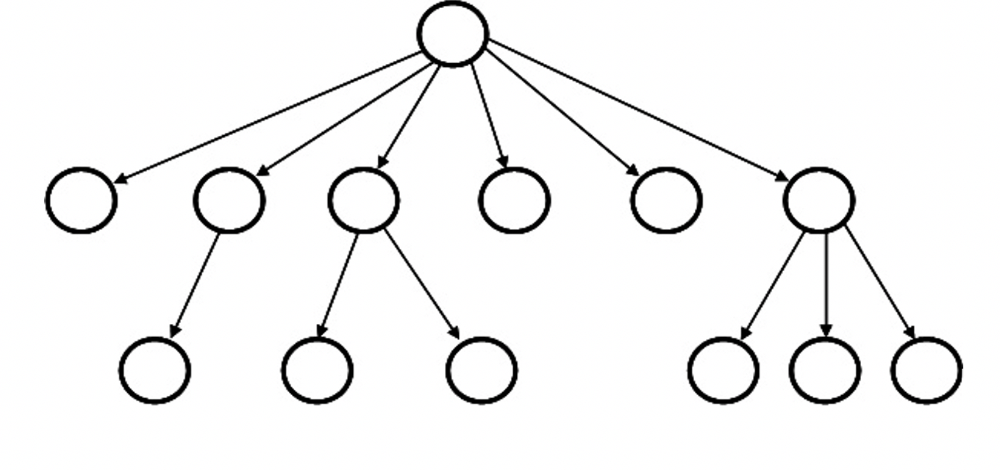

# File System Simulator

[](../../actions)

## Project Objective:

Develop a program that simulate a Linux file system and a terminal to interact
with the "simulated" file system.

## Learning Outcomes:

Develop a Java program that uses:

- Trees data structure

### Project overview:

The goal of this assignment is to make a basic directory maintenance simulator
that processes basic Unix/Linux commands.

We will use a tree to represent the directory structure: 

For simplicity, we will use the same type of node to represent a file or a
directory. Also, since we will need to traverse the tree towards the root for
some commands, it is useful to maintain a reference within each node that points
to its parent.

#### This Project

We will simulate several of the UNIX/Linux operating system commands for a
directory system in order to add directories, add files, list directory
contents, etc. Issuing a command to create a directory, or example, should not
result into creating an actual directory in your file system, but rather a node
in your simulated directory tree.

### Project Requirements:

Your application must function as described below:

1. Your program must satisfy all requirements in the test suites contained in
   [src/test/java](src/test/java).

   - Running all tests can be accomplished in the command line by running
     `gradle test`.
   - Individual tests can be run by running `gradle test_node_creation`,
     `gradle test_node_chaining`, `gradle test_fs_basic`, `gradle test_fs_mv`,
     `gradle test_fs_ls` , and `gradle test_fs_rm`.

#### Commands

We will implement the following commands:

```
ls              // lists all files and directories in the current directory,
                // indicating whether the entry is a file or directory. See the test cases
mkdir <dirname> // creates a new directory if it does not already exist
cd <dirname>    // changes into specified directory if it exists
cd ..           // changes to the parent directory
pwd             // specifies the current directory: root/nextdir/etc/
touch <filename> // adds a file to the current directory
mv <fname1> <fname2> //change the name of the file or directory to the new name
rm <filename>   // locate and remove the file or directory
exit             // ends the session

```

For simplicity, commands are expected to operate on the current directory only.
In other words, you will **NOT** need to handle cases such as
`touch test/dir1/dir2`.

## Sample Run

The following is a sample run of the File System Simulator:

<pre><code>
$ ls

$ pwd
/root
$ mkdir test

$ cd foo
No such file or directory
$ cd test

$ ls

$ mkdir dir

$ pwd
/root/test
$ ls
d dir

$ cd dir

$ pwd
/root/test/dir
$ cd anothertest
No such file or directory
$ mkdir dir2

$ touch dir2
File or directory already exists
$ ls
d dir2

$ touch file

$ ls
f file
d dir2

$ mv dir2 dir

$ ls
f file
d dir

$ rm file

$ ls
d dir

$ rm nofile
No such file or directory
$ pwd
/root/test/dir
$ wrongcommand
unknown command
$ touch 
improper command
$ exit
</code></pre>

## Implementation Notes:

1. Ensure that `gradle test` passes all test assertions, otherwise you will not
   get full credit.

1. You are not supposed to change the test suit to make assertions pass.
   Instead, you need to change your code.

### Submission Requirements:

1. All code must be added and committed to your local git repository.
2. All code must be pushed to the GitHub repository created when you "accepted"
   the assignment.
   1. After pushing, with `git push origin main`, visit the web URL of your
      repository to verify that your code is there. If you don't see the code
      there, then we can't see it either.
3. Your code must compile and run. The auto-grading tests will indicate your
   score for your submission.
   1. The auto-grading build should begin automatically when you push your code
      to GitHub.
   2. If your program will not compile, the graders will not be responsible for
      trying to test it.
4. You are expected not to make more pushes after the project is due.

## Important Notes:

- Projects will be graded on whether they correctly solve the problem, and
  whether they adhere to good programming practices.
- Projects must be received by the time specified on the due date. Projects
  received after that time will get a grade of zero.
- Please review the academic honesty policy.
  - Note that viewing another student's solution, whether in whole or in part,
    is considered academic dishonesty.
  - Also note that submitting code obtained through the Internet or other
    sources, whether in whole or in part, is considered academic dishonesty.
  - All programs submitted will be reviewed for evidence of academic dishonesty,
    and all violations will be handled accordingly.

## Grading

- View on GitHub:
  1.  On your GitHub repo page, Click the :arrow_forward: **Actions** tab to see
      your graded results.
  1.  If it isn't a green check mark (:heavy_check_mark:) then at least part of
      the testing failed.
  1.  Click the commit message for the failing version then click "Autograding"
      on the left side of the page.
  1.  Follow the :x: path and expand things to see what errors exist.
  1.  At the bottom of the _education/autograding_ section, you can view the
      score for the auto-grading portion of the rubric. It will look something
      like **_90/100_**.
